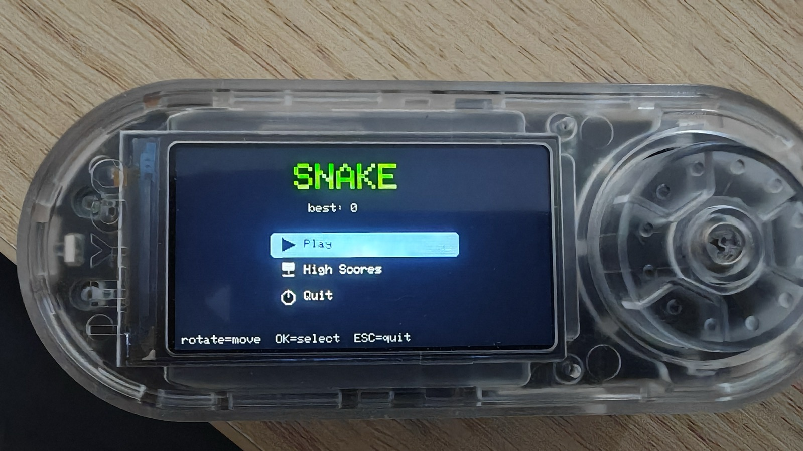
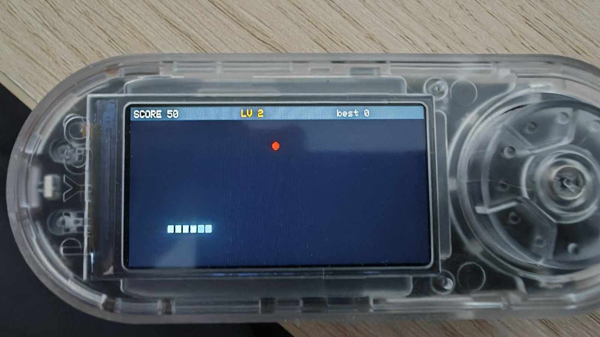
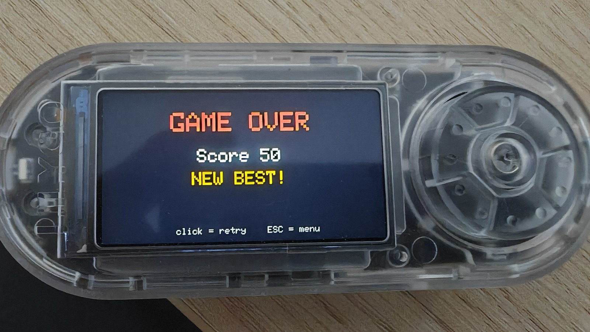

# 🐍 Snake — Bruce / LilyGO T-Embed CC1101

  [-F7DF1E)](https://github.com/BruceDevices/firmware) 

> **EN** — An arcade **Snake** for the Bruce JS interpreter, built around the rotary encoder. Levels change the snake's **color and speed**, obstacles appear as you progress, and a **persistent top-5 high score** table is saved on the SD card.

> **FR** — Un **Snake** arcade pour l'interpréteur JS de Bruce, pensé pour la molette. Les niveaux changent la **couleur et la vitesse** du serpent, des obstacles apparaissent, et un **tableau des 5 meilleurs scores** est sauvegardé sur la carte SD.

## 🎮 Controls / Contrôles

The rotary encoder does everything — **rotate = turn left/right** (relative to the snake's heading, so you can never instantly reverse into yourself), **click = pause**, **ESC = menu**.

## ✨ Features / Fonctions

- 🌈 **Levels** — every few apples you level up: the snake **changes color** (8-color palette) and gets **faster** (180 ms → 60 ms), with a "LEVEL n" flash.
- 🧱 **Obstacles** — walls start appearing from level 3 to raise the challenge.
- 🏆 **High scores** — persistent **top-5** saved to `/snake_scores.json`; enter **3 initials** on a new record, arcade style. Viewable from the menu.
- 🖥️ **Clean UI** — picto menu, HUD (score / level / best), flicker-free incremental rendering (apple = red dot, snake = tiles).

| Gameplay | Game over |
|---|---|
|  |  |

## 🚀 Install

1. Copy **`Snake.js`** onto the SD card (e.g. `/scripts` or `/BruceJS`).
2. On the device: **JS Interpreter → select `Snake.js`** (or add it to your favorites with [bruce-launcher](https://github.com/koua29/bruce-launcher)).
3. High scores are stored in `/snake_scores.json` on the SD.

## 🛒 Matériel / Hardware

Le matériel utilisé pour ce projet — liens affiliés Amazon :

|  |  |  |
|:---:|:---:|:---:|
| 🔌 **[LilyGO T-Embed CC1101](https://link.amazon/B0cgD7wou)** avec antennes | ⬛ **[LilyGO T-Embed CC1101](https://link.amazon/B071fmsbH)** noir, sans antenne | 📡 **[Kit d'antennes SMA](https://link.amazon/B0eMlSqeZ)** |

En tant que Partenaire Amazon, je réalise un bénéfice sur les achats remplissant les conditions requises. · As an Amazon Associate I earn from qualifying purchases.

## 🙏 Credits & License

- Script: **koua29**. Runs on the excellent **[Bruce firmware](https://github.com/BruceDevices/firmware)**.
- Released under the **MIT License** — see [LICENSE](LICENSE).

## ☕ Coffee?

